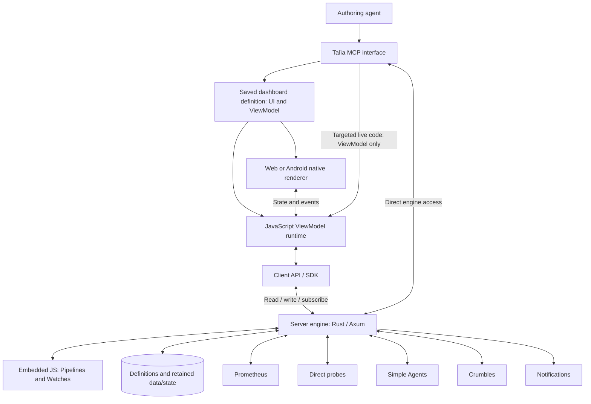

# Architecture boundaries

Status: agreed conceptual boundaries and language direction, 2026-09-18.
Detailed architecture remains open. See the [product specification](specification.md)
[dashboard model](dashboards.md) and [server engine](engine.md).

## Client and engine model

Arrows show responsibilities and information flow, not transport protocols or
deployment units. A live instance cannot have its View definitions rewritten
through the live manipulation capability.

A dashboard packages shared declarative UI and JavaScript logic. Its restricted
JSX-like source compiles into a validated UI tree. Native Android and web
renderers interpret the same definition; a JavaScript runtime executes the same
ViewModel behavior through the same engine interface on both platforms.

The client runtime provides the bridge between rendered Views, JavaScript and
engine operations. An Android bridge can be implemented in Kotlin; a web bridge
can use web facilities. Neither the engine nor Android renderer must be written
in JavaScript. The embedded JS runtime and renderer frameworks remain undecided.

The engine is server-owned and implemented in Rust/Axum, with an embedded
JavaScript runtime for configurable Pipeline and Watch logic. Clients expose
read, write and subscribe through an API/SDK for server state; their local
runtime owns only dashboard behavior and UI state. Monitoring continues without
connected clients. The specific JS runtime and isolation mechanism remain open.

All four engine primitives—DataSource, Pipeline, Variable and Watch—are configured
at runtime without restarting the service. Persist definitions, retained values,
Watch state and recovery checkpoints. SQLite remains a candidate. See the
[engine model](engine.md) for validation, recovery and open activation semantics.

## Variable execution boundary

Variables carry declared types, latest values, timestamps and quality information,
with configurable history. Computed values add getter/optional setter logic,
persistent server-side internal state and an injected time provider. Internal
state supports caching and lazy evaluation without a separate lazy Variable kind.
Declared dependencies drive subscribed re-evaluation; external-source values also
support refresh/invalidation. See [engine semantics](engine.md#variables-and-computed-values).

Getter/setter execution is serialized per instance, including awaits. Server
instances serialize all callers; local frontend instances serialize within that
frontend. This boundary must cover other writes to the same Variable too.
Cross-instance transactions, failure rollback, crash consistency, side-effect
atomicity and dependency-cycle handling remain separate design questions.

## Persistent and live state

Persistent dashboard authoring changes the saved UI and ViewModel definition.
Live MCP interaction targets the ViewModel of a specific running instance,
leaving View definitions unchanged. Modifications mark that instance dirty and
are temporary until reload; they do not automatically update the saved definition.
Reload reconstructs the dashboard from its saved definition and clears temporary
modifications, while preserving effects already performed through the engine.

Ordinary state-driven UI updates are allowed, including conditional/repeated
content declared by the saved View definition. They do not grant a live script
permission to modify the definition itself. Precise dirty tracking, versioning,
reload and synchronization semantics still need design.

## Monitoring responsibilities

The engine supplies monitoring capabilities, data and operations behind dashboard
bindings and MCP tools. Talìa coordinates schedules, observations, rule evaluation,
delegated work, outcome actions and notifications. Agents configure dashboards,
checks, schedules and alerts through MCP; humans interact with the resulting UI.
A built-in assistant versus external MCP authoring clients is an open choice.

Prometheus supplies current and historical metrics. Direct probes supply further
observations. Talìa-managed LLM-assisted checks, analyses and investigations run
through Simple Agents, without a direct SimpleAI integration. Crumbles provides
ticket workflows whose lifecycle and outcomes Talìa follows and acts upon.

Engine checks and task workflows are distinct from dashboard-local UI behavior;
the detailed execution and availability guarantees remain to be defined.

## Concepts to represent

These are concepts, not a database schema:

| Concept | Purpose |
|---|---|
| Dashboard definition | Shared JSX-like UI and JavaScript ViewModel source, with validated representation |
| Client / live instance | Selected configuration, active runtime state, identity for MCP targeting, dirty status |
| Screen / ViewGroup / View | Configurable composition, layout, bindings and interactive elements |
| Engine operation / subscription | Stable capability exposed to ViewModels and MCP |
| DataSource | Connection to an external data origin; shared by collection Pipelines |
| Pipeline | Automatically, conditionally or explicitly executed collection/transformation work |
| Variable | Named typed value with timestamp and quality/freshness information |
| Watch definition / instance | Shared JS behavior, per-instance parameters and durable state |
| Shared definition / reference | Reuse across Watches, UI elements, ViewModel elements and functions |
| Scheduled task and run | Recurring work and a particular execution |
| Delegated work reference | Simple Agents session or Crumbles ticket, progress and outcome |
| Alert rule and occurrence | Condition/actions and an instance of that condition |
| Outcome trigger | Action selected from monitored work's result or lifecycle |
| Notification or follow-up action | Delivery or execution caused by a rule/trigger |

## Existing integration evidence

The inspected [Simple Agents public contract](../../simple-agents/contracts/v1/README.md)
supports repository-free sessions, bounded execution, progress events, results,
controls, and caller-scoped idempotency. Its
[client documentation](../../simple-agents/docs/CLIENT.md) describes replay and
reconciliation. These are available mechanisms, not a choice of client language
or polling transport.

Crumbles' Talìa-facing contract has not been investigated or defined. Ticket
creation, lifecycle observation, result retrieval and outcome semantics require
that work. Do not infer these operations from Simple Agents' contract or assume
that a closed ticket proves a successful check.

## Decisions still to make

- Exact UI language, intermediate representation and ViewModel APIs; see the
  [dashboard open details](dashboards.md#open-details).
- Specific JS runtimes, renderer frameworks, storage and deployment topology.
- Engine API types, client bridge/transport design and stream semantics.
- Runtime activation, dependency validation, shared-definition propagation and
  state migration; server ownership and Rust/Axum are decided.
- Definition storage/versioning, client assignment and live MCP connectivity.
- Scheduling and event processing, durable recovery and duplicate prevention
  for sessions, tickets, notifications and chained actions.
- Authentication, authorization, script isolation, secrets and execution authority.
- Integration lifecycle/result adapters, caching, history and retention.
- Alert evaluation ownership and coexistence or migration with Alertmanager.
- Log data sources and any Loki integration.
- Deployment, availability targets, monitoring of Talìa, backups and recovery.

Rust/Axum is now selected; SQLite remains provisional. The earlier endpoint list, host-collector design,
evidence-only restriction, fixed budgets/cadences, retention periods and private
single-instance deployment remain withdrawn as specification commitments.
