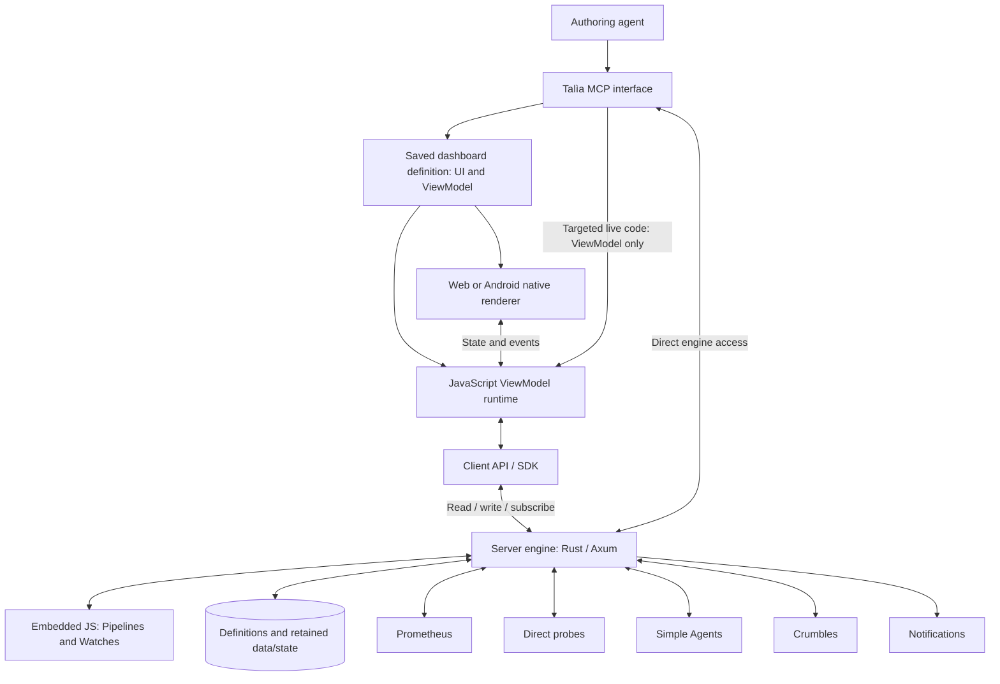

# Architecture boundaries

Accepted P3 collection, scheduling and Watch decisions are consolidated in
[Monitoring contract](monitoring.md), superseding corresponding open questions here.
Accepted P4 authoring and live-control decisions are specified in the
[MCP contract](mcp-contract.md); it defines implementation requirements, not completed tools.

Status: agreed conceptual boundaries and language direction, 2026-09-18.
Detailed architecture remains open. See the [product specification](specification.md),
[dashboard model](dashboards.md) and [server engine](engine.md).

Planning, open-decision tracking and execution status live in the
[Crumbles Stories](implementation-plan.md). This document is technical reference;
its open questions are inputs to Story refinement.

The [user access contract](user-access.md) defines admin-only authoring/sharing,
read-only dashboard-scoped viewer access, account defaults and client overrides.
It supersedes earlier open questions about dashboard ownership and user permissions.

## Client and engine model

Arrows show responsibilities and information flow, not transport protocols or
deployment units. A live instance cannot have its View definitions rewritten
through the live manipulation capability.

A dashboard packages shared declarative UI and JavaScript logic. Its restricted
JSX-like source compiles into a validated UI tree. Native Android and web
renderers interpret the same definition; a JavaScript runtime executes the same
ViewModel behavior through the same engine interface on both platforms.

The client runtime provides the bridge between rendered Views, JavaScript and
engine operations. An Android bridge can be implemented in Kotlin; a web bridge
can use web facilities. Neither the engine nor Android renderer must be written
in JavaScript. P1 uses bounded QuickJS hosts, DOM rendering on web, and native Android Views.

The engine is server-owned and implemented in Rust/Axum, with an embedded
JavaScript runtime for configurable Pipeline and Watch logic. Clients expose
read, write and subscribe through an API/SDK for server state; their local
runtime owns only dashboard behavior and UI state. Monitoring continues without
connected clients. P2 uses bounded QuickJS contexts on a local async executor for computed values.
P3 adds bounded asynchronous Pipeline capabilities, durable scheduling, ordered
Watch evaluation and atomic investigation admission; see [monitoring](monitoring.md).

All four engine primitives—DataSource, Pipeline, Variable and Watch—are configured
at runtime without restarting the service. Persist definitions, retained values,
Watch state and recovery checkpoints. P2 uses SQLite with WAL and synchronous FULL commits. See the
[engine model](engine.md) for validation, recovery and open activation semantics.

## Variable execution boundary

Variables carry declared types, latest values, timestamps and quality information,
with configurable history. Computed values add getter/optional setter logic,
persistent server-side internal state and an injected time provider. Internal
state supports caching and lazy evaluation without a separate lazy Variable kind.
Declared dependencies drive subscribed re-evaluation; external-source values also
support refresh/invalidation. See [engine semantics](engine.md#variables-and-computed-values).

JavaScript execution uses normal event-loop interleaving: reads, getters and setters
can await, and the same instance remains available to other operations during I/O.
Only short synchronous state updates are atomic; no whole-operation lock spans an
await. Server updates coordinate all clients at the authoritative engine, while
frontend-local updates belong to that frontend. Results computed across awaits
need guarded publication against changed state or configuration.

Computed values choose shared in-flight refresh or independent getter executions.
Shared refresh does not block setters or other operations. Dependency cycles fail
immediately. Cancelled work is skipped before starting or prevented from making
subsequent commits/effect dispatch; effects already dispatched are not undone.
Conflict resolution, shared-reader cancellation, durable commit semantics and the
exact APIs remain open. See the [engine model](engine.md#async-execution-and-atomic-updates).

## Persistent and live state

Persistent dashboard authoring changes the saved UI and ViewModel definition.
Live MCP interaction targets the ViewModel of a specific running instance,
leaving View definitions unchanged. Modifications mark that instance dirty and
are temporary until reload; they do not automatically update the saved definition.
Reload reconstructs the dashboard from its saved definition and clears temporary
modifications, while preserving effects already performed through the engine.

Ordinary state-driven UI updates are allowed, including conditional/repeated
content declared by the saved View definition. They do not grant a live script
permission to modify the definition itself. The [P4 MCP contract](mcp-contract.md)
defines identity, dirty tracking, atomic authoring, revision conflicts and dedicated
reload semantics.

## Monitoring responsibilities

The engine supplies monitoring capabilities, data and operations behind dashboard
bindings and MCP tools. Talìa coordinates schedules, observations, rule evaluation,
delegated work, outcome actions and notifications. Agents configure dashboards,
checks, schedules and alerts through MCP; humans interact with the resulting UI.
P4 exposes MCP to external agents. Embedded chat is outside this stage.

Prometheus supplies current and historical metrics. Direct probes supply further
observations. Talìa-managed LLM-assisted checks, analyses and investigations run
through Simple Agents, without a direct SimpleAI integration. Crumbles provides
ticket workflows whose lifecycle and outcomes Talìa follows and acts upon.

Engine checks and task workflows are distinct from dashboard-local UI behavior;
the detailed execution and availability guarantees remain to be defined.

## Concepts to represent

These are concepts, not a database schema:

| Concept | Purpose |
|---|---|
| Dashboard definition | Shared JSX-like UI and JavaScript ViewModel source, with validated representation |
| Client / live instance | Selected configuration, active runtime state, identity for MCP targeting, dirty status |
| Screen / ViewGroup / View | Configurable composition, layout, bindings and interactive elements |
| Engine operation / subscription | Stable capability exposed to ViewModels and MCP |
| DataSource | Connection to an external data origin; shared by collection Pipelines |
| Pipeline | Automatically, conditionally or explicitly executed collection/transformation work |
| Variable | Named typed value with timestamp and quality/freshness information |
| Watch definition / instance | Shared JS behavior, per-instance parameters and durable state |
| Shared definition / reference | Reuse across Watches, UI elements, ViewModel elements and functions |
| Scheduled task and run | Recurring work and a particular execution |
| Delegated work reference | Simple Agents session or Crumbles ticket, progress and outcome |
| Alert rule and occurrence | Condition/actions and an instance of that condition |
| Outcome trigger | Action selected from monitored work's result or lifecycle |
| Notification or follow-up action | Delivery or execution caused by a rule/trigger |

## Existing integration evidence

The inspected [Simple Agents public contract](../../simple-agents/contracts/v1/README.md)
supports repository-free sessions, bounded execution, progress events, results,
controls, and caller-scoped idempotency. Its
[client documentation](../../simple-agents/docs/CLIENT.md) describes replay and
reconciliation. These are available mechanisms, not a choice of client language
or polling transport.

Crumbles' Talìa-facing contract has not been investigated or defined. Ticket
creation, lifecycle observation, result retrieval and outcome semantics require
that work. Do not infer these operations from Simple Agents' contract or assume
that a closed ticket proves a successful check.

## Decisions still to make

- Exact UI language, intermediate representation and ViewModel APIs; see the
  [dashboard remaining scope](dashboards.md#historical-open-details-and-remaining-scope).
- Specific JS runtimes, renderer frameworks, storage and deployment topology.
- Engine API types, client bridge/transport design and stream semantics.
- Runtime activation, dependency validation, shared-definition propagation and
  state migration; server ownership and Rust/Axum are decided.
- Definition storage/versioning, client assignment and live MCP connectivity.
- Scheduling and event processing, durable recovery and duplicate prevention
  for sessions, tickets, notifications and chained actions.
- Authentication, authorization, script isolation, secrets and execution authority.
- Integration lifecycle/result adapters, caching, history and retention.
- Alert evaluation ownership and coexistence or migration with Alertmanager.
- Log data sources and any Loki integration.
- Deployment, availability targets, monitoring of Talìa, backups and recovery.

Rust/Axum is now selected; SQLite remains provisional. The earlier endpoint list, host-collector design,
evidence-only restriction, fixed budgets/cadences, retention periods and private
single-instance deployment remain withdrawn as specification commitments.

## Implementation sequence

The [first milestone plan](implementation-plan.md) develops web and native Android
together. Runtime, UI-contract and persistence prototypes precede final choices
of JS host, renderer framework and storage adapter. Candidate runtime libraries
are not yet selected or qualified.

## Shared dashboard implementation

[P1](../dashboard/README.md) now supplies a restricted UI compiler, shared
JavaScript ViewModel bindings, a DOM renderer and native Android Views. The same
versioned package includes UI references and VM source. Web hosts VM scripts in a
capped QuickJS WASM Worker; Android uses native QuickJS on a HandlerThread with a
separate trusted UI context. Network operations run asynchronously outside guest
execution. Client preferences select composition and web dp scale.

The development adapter still uses the loopback, in-memory Rust engine fixture.
This does not implement the durable production engine, authenticated MCP service,
notification delivery or deployment. [Qualification](p1-qualification.md) records
which concrete builds and platforms have been exercised.

## P2 durable implementation

The [engine implementation](../engine/README.md) separates persistent definitions, instance data and action records from disposable JS execution contexts. Configuration activation and state migrations commit atomically; I/O waits release the executor. Shared computed reads retain producer lifetime independently of callers. Tagged values preserve JavaScript exceptional numbers and undefined through SQLite and both renderers.

Client-owned connection state survives dashboard failure. A new server incarnation triggers snapshot replacement, subscription restoration and action reconciliation before the brief back-online indicator. The loopback service and sample client grants are development scope; authentication, remote deployment, source adapters and full MCP integration remain later stories.

## Alert delivery contract

See [configurable alerts](alerts.md) for the accepted staged-policy, acknowledgement,
silence, destination and durable delivery model. Android push, email and Telegram
alert delivery precede deployment and homelab migration; Simple Agents and Crumbles
delegation follow migration. Current work is tracked in TALIA-47.

## Implemented alert boundary

The Rust engine now owns alert occurrences, policy/binding definitions, evaluation
state, silences, destinations, installations, delivery slots and audits in SQLite.
Bounded QuickJS policy evaluations receive named engine samples and request declared
response actions; they cannot access provider credentials or perform network I/O.
The provider worker pool claims durable jobs, releases the Store borrow, then awaits
SMTP or HTTP I/O. Each destination has independent delivery/retry state.

Authenticated MCP tools and the platform-host `/alerts` API share the same operation
implementation and independent `alerts` permission family. Web/Android ViewModels
use shared `ctx.alerts` operations or subscribe to `alerts`; platform hosts enforce
package grants and keep credentials out of the JS context. Native notification
handlers are host code, independent of a live dashboard. Current implementation and
qualification limits are documented in [alerts](alerts.md) and its
[qualification report](alert-qualification.md).
